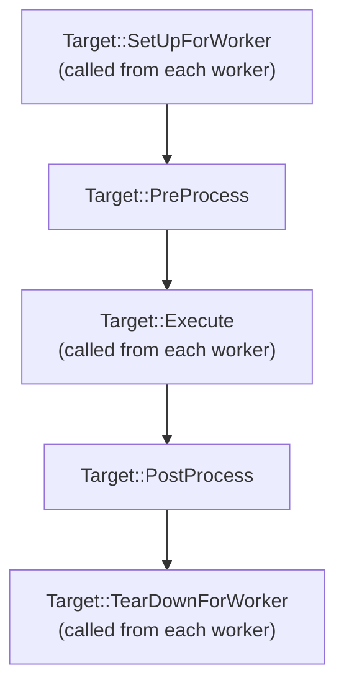

# C++ Benchmarker

[](https://github.com/dbgroup-nagoya-u/cpp-benchmark/actions/workflows/ubuntu_24.yaml) [](https://github.com/dbgroup-nagoya-u/cpp-benchmark/actions/workflows/ubuntu_22.yaml) [](https://github.com/dbgroup-nagoya-u/cpp-benchmark/actions/workflows/mac.yaml)

- [Build](#build)
    - [Prerequisites](#prerequisites)
    - [Build Options](#build-options)
    - [Build and Run Unit Tests](#build-and-run-unit-tests)
- [Usage](#usage)
    - [Linking by CMake](#linking-by-cmake)
    - [Flowchart of User-defined Functions in RunBench](#flowchart-of-user-defined-functions-in-runbench)
- [Acknowledgments](#acknowledgments)

## Build

### Prerequisites

```bash
sudo apt update && sudo apt install -y build-essential cmake
cd <path_to_your_workspace>
git clone git@github.com:dbgroup-nagoya-u/cpp-benchmark.git
```

### Build Options

#### Parameters for Unit Testing

- `CPP_BENCH_BUILD_TESTS`: build unit tests for this repository if `ON` (default: `OFF`).
- `DBGROUP_TEST_THREAD_NUM`: the maximum number of threads to perform unit tests (default `2`).

### Build and Run Unit Tests

```bash
mkdir build && cd build
cmake .. -DCMAKE_BUILD_TYPE=Release -DCPP_BENCH_BUILD_TESTS=ON
cmake --build . --parallel --config Release
ctest -C Release
```

## Usage

### Linking by CMake

Add this library to your build in `CMakeLists.txt`.

```cmake
FetchContent_Declare(
    cpp-benchmark
    GIT_REPOSITORY "https://github.com/dbgroup-nagoya-u/cpp-benchmark.git"
    GIT_TAG "<commit_tag_you_want_to_use>"
)
FetchContent_MakeAvailable(cpp-benchmark)

add_executable(
  <target_bin_name>
  [<source> ...]
)
target_link_libraries(<target_bin_name> PRIVATE
  dbgroup::cpp_benchmark
)
```

### Flowchart of User-defined Functions in RunBench



## Acknowledgments

This work is based on results obtained from project JPNP16007 commissioned by the New Energy and Industrial Technology Development Organization (NEDO). In addition, this work was supported partly by KAKENHI (16H01722 and 20K19804).
